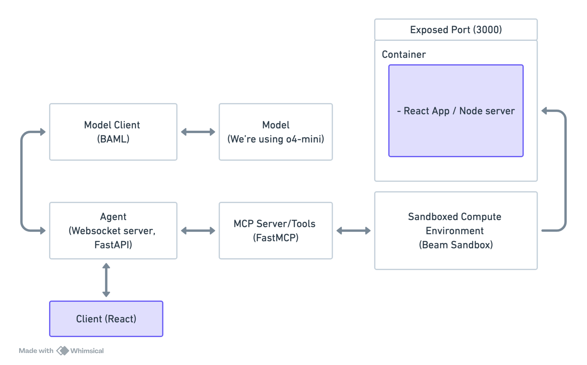

# Lovable Clone - AI-Powered Web App Builder

A real-time AI-powered web application builder inspired by [lovable.dev](https://lovable.dev).


## ️Architecture

This project demonstrates how to build a simple agent using sandboxed environments, MCP servers, and [BAML](https://github.com/BoundaryML/baml). It's hosted on [beam.cloud](https://beam.cloud).

> To learn about the architecture in detail, read the full post [on our blog](https://www.beam.cloud/blog/agentic-apps).

The application consists of three main components:

1. **Model Client** - Communication with LLM, based on [BAML](https://github.com/BoundaryML/baml)
2. **Sandbox Environment** - Runs the React preview in a compute sandbox on [Beam](https://beam.cloud).
3. **WS-Based Agent** - Streams edit requests from the user to the agent



## Prerequisites

- Python 3.12+
- Node.js 20+
- OpenAI API key
- [Beam](https://beam.cloud) account for hosting ([sandboxes](https://docs.beam.cloud/v2/sandbox/overview), frontend, mcp server)

## Installation

1. **Clone and install**

   ```bash
   git clone https://github.com/beam-cloud/lovable-clone
   cd lovable-clone
   pip install -r requirements.txt
   ```

2. **Install frontend dependencies**

   ```bash
   cd frontend
   npm install
   ```

3. **Set up secrets**

You can grab your OpenAI API key [here](https://platform.openai.com/api-keys).

```bash
beam secret create OPENAI_API_KEY 'your-openai-api-key'
```

4. **Add `.env`**

Create an `.env` file in `/frontend`

You’ll need a [Beam token](https://platform.beam.cloud/settings/api-keys) and the websocket URL, printed in your shell after running the command below.

```bash
VITE_BEAM_WS_URL=your-agent-ws-url # URL printed in your shell after running `beam serve` - fill this in after running the command below
VITE_BEAM_TOKEN=your-beam-token # Get Beam token here: https://platform.beam.cloud/settings/api-keys
```

## Usage

### Start the Agent

The agent handles real-time communication with the client/frontend:

```bash
beam serve src/agent.py:handler
```

> Paste the websocket URL printed in your shell into your `.env` file above

### Run the Frontend

In a new terminal window, run:

```bash
cd frontend
npm run dev
```

### BAML / Prompts

Prompts are defined in `baml_src/build.baml`:

- **EditCode Function** - Main function for code generation
- **CodeChanges Schema** - Defines the structure of AI responses
- **Test Cases** - Validate prompt behavior

> If you want to change the prompt, edit `baml_src/build.baml` and run `make generate` to regenerate the BAML clients

### Sandbox Environment

The sandbox environment is managed in `src/tools.py`:

- Node.js 20 base image
- React + Vite + shadcn/ui template
- Other deps: React Router, Recharts, TanStack Query, etc.
